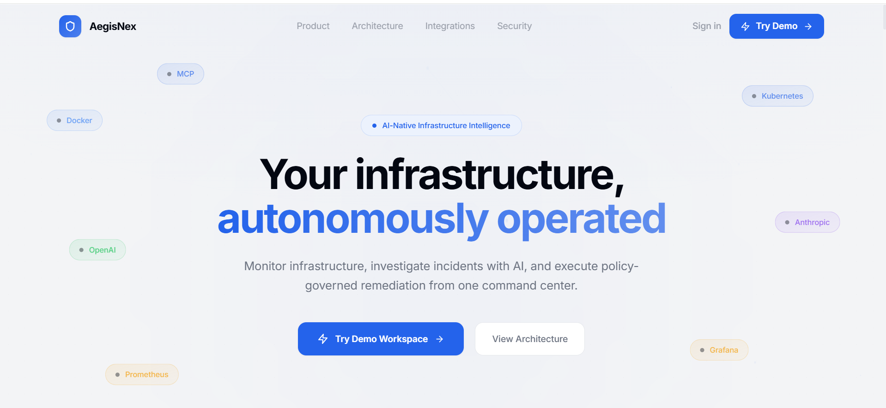

<div align="center">
  
</div>

<h1 align="center">AegisNex</h1>

<p align="center">
  <em>Open-source infrastructure observability, AI-driven incident response, and autonomous remediation.</em>
</p>

<p align="center">
  <a href="https://github.com/your-org/aegisnex/actions"></a>
  
  
  
  
  
  
  <br>
  
  
  
  
  
  
</p>

<p align="center">
  <a href="#why-aegisnex">Why</a> •
  <a href="#features">Features</a> •
  <a href="#architecture">Architecture</a> •
  <a href="#quick-start">Quick Start</a> •
  <a href="#documentation">Docs</a> •
  <a href="#contributing">Contributing</a>
</p>

---

## Table of Contents

- [Why AegisNex](#why-aegisnex)
- [Features](#features)
  - [Infrastructure Monitoring](#infrastructure-monitoring)
  - [AI Intelligence Engine](#ai-intelligence-engine)
  - [AI Workforce, Mission Control & Governance](#ai-workforce-mission-control--governance)
  - [Autonomous Operations](#autonomous-operations)
  - [Enterprise Platform](#enterprise-platform)
  - [Compliance](#compliance)
  - [Security Scanning Pipeline](#security-scanning-pipeline)
  - [Frontend](#frontend)
- [Architecture](#architecture)
- [Quick Start](#quick-start)
  - [Prerequisites](#prerequisites)
  - [Backend](#backend)
  - [Frontend](#frontend-1)
  - [Docker](#docker)
  - [CLI](#cli)
- [Configuration](#configuration)
- [Technology Stack](#technology-stack)
- [Project Structure](#project-structure)
- [Documentation](#documentation)
- [Roadmap](#roadmap)
- [Contributing](#contributing)
- [License](#license)

---

## Why AegisNex

Infrastructure teams today face a fractured toolchain. Monitoring in one dashboard, incidents in another, alerts in Slack, runbooks in Git, compliance in spreadsheets, and AI tools that have no connection to your actual infrastructure.

**AegisNex replaces 6+ tools with one cohesive platform.**

| Problem | How AegisNex Solves It |
|---|---|
| Fragmented monitoring across tools | Unified observability — system metrics, containers, HTTP/SSL/TCP/DNS, all in one place |
| Alert fatigue from noisy notifications | AI-powered risk scoring and policy gates filter signal from noise |
| Manual incident response slows remediation | LangGraph engine plans, executes, verifies, and learns from every incident |
| Multiple dashboards with no single pane of glass | Next.js dashboard + Grafana + CLI — three interfaces, one backend |
| AI tools disconnected from operations | AI engine has direct access to monitoring, containers, incidents, and runbooks |
| Compliance audits require manual evidence gathering | 5 built-in frameworks (ISO 27001, SOC 2, NIST, CIS, OWASP) with automated assessments |
| No audit trail for infrastructure changes | Every action logged via OpenTelemetry instrumentation |

AegisNex is **self-hosted, open-source, and multi-tenant**. No vendor lock-in, no per-seat licensing, no data leaving your network.

---

## Features

### Infrastructure Monitoring

Real-time visibility across your entire stack. The `MonitoringEngine` collects system metrics via `psutil`, tracks Docker container states, and runs health checks against HTTP endpoints, SSL certificates, TCP ports, and DNS records. All data flows to a Prometheus exporter and 4 pre-built Grafana dashboards.

- System resource monitoring (CPU, memory, disk, network)
- Docker container health tracking with auto-remediation
- HTTP/HTTPS endpoint monitoring with status code validation
- SSL certificate expiry monitoring
- TCP port connectivity checks
- DNS resolution health checks
- Prometheus `/metrics` endpoint
- 4 Grafana dashboards (infrastructure, containers, incidents, remediation)

### AI Intelligence Engine

A LangGraph-based workflow engine that plans, executes, and learns from operational tasks. Unlike simple chatbots, the AegisNex AI has **tool-level access** to your infrastructure — it can check metrics, inspect containers, query incidents, and execute runbooks.

- 12-node `StateGraph` with conditional routing (planner, executor, verifier, self-corrector, goal evaluator)
- Multi-LLM support: OpenAI, Anthropic, Ollama, Azure OpenAI, Gemini
- Per-tool risk scoring (0–1) with configurable auto-execute thresholds
- 6 default policies enforcing business rules (no production restarts during business hours, max restart attempts, etc.)
- RAG pipeline ingesting incidents, audit logs, monitoring history, reports, and runbooks
- 6 AI memory tables for conversations, incidents, recommendations, and learnings
- Runbook engine with parallel step groups, conditions, retries, and approval gates
- 5 built-in AI skills (system analyzer, incident investigator, container manager, report generator, security auditor)

### AI Workforce, Mission Control & Governance

A dedicated multi-agent collaboration layer sits above the LangGraph engine: a `SupervisorAgent` coordinates seven domain agents (`InfrastructureAgent`, `DockerAgent`, `MonitoringAgent`, `IncidentAgent`, `ReportingAgent`, `KnowledgeAgent`, `ComplianceAgent`) that can be dispatched a task, fanned out in parallel, or made to collaborate on one problem. Every AI request — chat, plan, tool call, knowledge search, Docker action, governance approval — becomes a tracked, replayable `Execution` record.

- **AI Workforce** (`/workforce`): create, clone, pause, resume agents; per-agent versions, prompts, permissions, knowledge attachments, trust scoring, and budget tracking — fully database-backed, no placeholder data
- **Mission Control** (`/mission-control`): live execution visualization with replay mode and multi-agent tracking
- **AI Governance** (`/governance`): agent registry, action-level audit trail, policy enforcement, anomaly detection
- **Approvals** (`/approvals`): the human-in-the-loop queue for any action the policy engine classifies as requiring sign-off before it runs
- **Explanations**: every autonomous action carries a machine-generated rationale and evidence trail, not just a log line
- **Cost-aware LLM routing (CommandMesh)**: query-complexity scoring automatically routes each request to a `cheap` / `medium` / `frontier` model tier by cost-per-million-tokens, configurable per deployment

### Autonomous Operations

The system doesn't just alert — it acts. The `Guardian` module detects container failures and auto-restarts within configurable cooldowns and max-attempt limits. The healing module can execute predefined remediation actions without human intervention.

- Guardian auto-restart with exponential cooldown
- Incident lifecycle: Open → Acknowledged → In Progress → Resolved → Closed
- Notification channels: Email (SMTP), Slack, Discord, PagerDuty, Teams, generic Webhook
- Full audit trail for every mutation
- Multi-agent collaboration across Operations, Security, Compliance, and Infrastructure supervisors

### Enterprise Platform

Built for organizations from day one. Multi-tenancy with data isolation at the application layer, a plugin system with 6 plugin types, an integration marketplace with 11 providers, and cross-domain enterprise search across 12 data domains.

- Multi-tenancy: Organizations → Teams → Projects with row-level isolation
- MSP-style **Clients** workspace (`/clients`): manage the organizations this deployment serves as the boundary for incidents, approvals, and execution evidence
- Plugin system: Tool, Integration, Skill, Workflow, Notification, Compliance plugins
- Integration marketplace: GitHub, GitLab, Jira, ServiceNow, Slack, Teams, PagerDuty, Discord, Kubernetes, Prometheus, Grafana
- Enterprise search across 12 domains: incidents, targets, reports, audit logs, compliance, runbooks, AI conversations, settings, containers, integrations, knowledge, workflows
- Knowledge management with document upload, directory indexing, semantic search (RAG)
- Visual workflow designer with storage and execution engine
- Built-in **MCP server** (`src/mcp_server.py`) exposing system health, containers, incidents, metrics, and monitoring as MCP tools for external AI clients (e.g. Claude Desktop)
- **Demo login**: one-click, restricted `read_only` session (`AEGISNEX_DEMO_ENABLED=true`) for safely demoing a production deployment without exposing real credentials

### Compliance

Five compliance frameworks with automated assessment engines. Each framework defines controls, the engine runs checks against your infrastructure, and evidence is collected automatically.

- ISO 27001 (114 controls), SOC 2 (65), NIST CSF (98), CIS Controls (153), OWASP Top 10
- Automated assessments triggered via API or scheduler
- Evidence collection and report generation
- Compliance dashboard with per-framework results

### Security Scanning Pipeline

Dockerized security scanners that run as part of your CI/CD pipeline or on a schedule. Results feed into a unified threat matrix.

- Network reconnaissance via Nmap (Dockerized)
- Application vulnerability auditing via Nuclei (Dockerized)
- Automated telemetry ingestion into `unified_threat_matrix.json`
- GitHub Actions CI/CD integration

### Frontend

A Next.js 14 dashboard with 19 route pages, real-time WebSocket updates, and a premium dark theme. Falls back to Jinja2 templates for backend-only deployments.

- 19 app router pages: `dashboard`, `infrastructure`, `containers`, `incidents`, `targets`, `mission-control`, `workforce`, `governance`, `approvals`, `ai`, `mcp`, `integrations`, `notifications`, `reports`, `search`, `audit`, `clients` (+ client detail/unassigned sub-routes), `settings`, `login`
- Real-time WebSocket streams for dashboard, incidents, containers, targets, container logs
- Radix UI components + Recharts charts + Tailwind CSS dark theme with glass panels
- Single API client (`lib/api.ts`) with automatic timeout, retry, and access-token refresh on 401; WebSocket helper (`lib/ws.ts`) with automatic reconnect/backoff

---

## Architecture

<p align="center">
  
</p>

The platform is organized into six layers:

| Layer | Technology | Responsibility |
|---|---|---|
| **Frontend** | Next.js 14 + React 18 + Tailwind | User interface, real-time dashboards |
| **API** | FastAPI + Uvicorn | 200+ REST endpoints, 5 WebSockets, auth, rate limiting |
| **Intelligence** | LangGraph + multi-LLM providers | AI workflow execution, tool governance, RAG, memory |
| **Integrations** | 11 provider modules | External service connectors (GitHub, Slack, PagerDuty, etc.) |
| **Compliance** | 5 framework engines | Automated assessments, evidence collection |
| **Data** | SQLite/PostgreSQL, SQLiteMemory, RAG, Search Index | Persistence, AI memory, knowledge retrieval |

Data flows: `User → FastAPI → Auth → Intelligence Engine (LangGraph) → Tools/Monitors → Response`

Detailed diagrams: [Architecture](assets/diagrams/overall-system.drawio) · [AI Workflow](assets/diagrams/ai-workflow.drawio) · [Monitoring Pipeline](assets/diagrams/monitoring-pipeline.drawio) · [Deployment](assets/diagrams/deployment.drawio) · [Enterprise](assets/diagrams/enterprise.drawio)

Full architecture documentation: [ARCHITECTURE.md](docs/ARCHITECTURE.md) · [AI_ARCHITECTURE.md](docs/AI_ARCHITECTURE.md)

---

## Quick Start

### Prerequisites

- Python ≥ 3.11, Node.js ≥ 18, Docker ≥ 24.0 (optional)

### Backend

```bash
git clone https://github.com/your-org/aegisnex.git
cd aegisnex
python -m venv venv && source venv/bin/activate
pip install -r requirements.txt
cp .env.example .env          # then edit AEGISNEX_JWT_SECRET
python -m src.scripts.init_db
uvicorn src.dashboard:app --reload --port 8000
```

Open http://localhost:8000 and use the seeded demo administrator account. The default local username is `admin`; set or rotate the password before public deployment.

### Frontend

```bash
cd frontend
npm install
npm run dev          # http://localhost:3000
npm run build        # production build
```

### Docker

```bash
# Grafana + Prometheus stack
cd grafana && docker compose up -d
# Grafana: admin/admin at http://localhost:3000

# Security scanners
cd deploy && docker compose up

# Demo environment (nginx, redis, postgres, failing-service)
docker compose -f docker-compose.demo.yml up
```

### CLI

```bash
python entrypoint.py --monitor       # system resource usage
python entrypoint.py --docker        # running containers
python entrypoint.py --guardian       # autonomous remediation
python entrypoint.py --weekly-report  # operational report
```

---

## Configuration

AegisNex uses both `.env` (environment variables) and `config.yaml` for configuration.

**Essential:**
| Variable | Default | Purpose |
|---|---|---|
| `AEGISNEX_JWT_SECRET` | — | 256-bit signing secret |
| `AEGISNEX_DATABASE_URL` | `sqlite:///aegisnex.db` | PostgreSQL for production |
| `AEGIS_AI_PROVIDER` | `openai` | LLM provider |
| `OPENAI_API_KEY` | — | Required for OpenAI |

Full reference: [DEPLOYMENT_GUIDE.md](docs/DEPLOYMENT_GUIDE.md) · [config.yaml](config.yaml)

---

## Technology Stack

<div align="center">

| | | | |
|---|---|---|---|
|  |  |  |  |
|  |  |  |  |
|  |  |  |  |
|  |  |  |  |

</div>

---

## Project Structure

```
aegisnex/
├── src/                     # Python backend (40+ modules)
│   ├── dashboard.py         # FastAPI app factory, 200+ routes, 5 WebSockets
│   ├── intelligence/        # LangGraph AI engine — graph, tools, risk, policy, RAG, memory, runbooks
│   ├── agents/               # Multi-agent workforce (1 supervisor + 7 domain agents)
│   ├── ai_workforce.py       # Agent lifecycle, versions, trust scoring, budgets
│   ├── mission_control.py    # Execution tracking/replay for every AI request
│   ├── ai_governance.py      # Agent registry, action audit, anomaly detection
│   ├── guardian.py / healing.py / policy_engine.py   # Autonomous remediation + safety gates
│   ├── monitor.py, docker_scanner.py, http_monitor.py, ssl_monitor.py,
│   │   tcp_monitor.py, dns_monitor.py                # Infrastructure monitors
│   ├── integrations/         # Marketplace + 11 provider modules + MCP/AI provider status
│   ├── compliance/           # 5 compliance frameworks (ISO 27001, SOC 2, NIST, CIS, OWASP)
│   ├── plugins/               # Plugin registry (6 types: tool/integration/skill/workflow/notification/compliance)
│   ├── skills/                # 5 built-in AI skills
│   ├── knowledge/, search/    # Document RAG pipeline + 12-domain enterprise search
│   ├── multitenant/            # Organization → Team → Project isolation
│   ├── workflow_designer/      # Visual workflow engine + storage
│   ├── mcp_server.py           # AegisNex-as-MCP-server for external AI clients
│   └── platform_db.py          # Single repository, SQLite or PostgreSQL by URL
├── frontend/                # Next.js 14 dashboard (19 routes, components in components/)
├── grafana/                 # Prometheus + Grafana with 4 dashboards
├── modules/                 # Dockerized Nmap + Nuclei scanners (decoupled recon pipeline)
├── scripts/generate_secrets.py  # Generates JWT/demo/Fernet secrets — prints only, never writes files
├── tests/                   # Test suite
└── docs/                    # Documentation files
```

Full structure: [REPOSITORY_STRUCTURE.md](docs/REPOSITORY_STRUCTURE.md)

---

## Documentation

| Document | Description |
|---|---|
| [ARCHITECTURE.md](docs/ARCHITECTURE.md) | System architecture, data flow, security model |
| [AI_ARCHITECTURE.md](docs/AI_ARCHITECTURE.md) | LangGraph workflow, tool registry, provider system |
| [API_REFERENCE.md](docs/API_REFERENCE.md) | Complete API reference (200+ endpoints) |
| [DEPLOYMENT_GUIDE.md](docs/DEPLOYMENT_GUIDE.md) | Production deployment, Docker, Kubernetes, scaling |
| [DEVELOPER_GUIDE.md](docs/DEVELOPER_GUIDE.md) | Development setup, coding conventions, extending |
| [ADMIN_GUIDE.md](docs/ADMIN_GUIDE.md) | User management, multi-tenant admin, troubleshooting |
| [DATABASE_SCHEMA.md](docs/DATABASE_SCHEMA.md) | Database tables, indexes, migrations |
| [ROADMAP.md](docs/ROADMAP.md) | Completed, in-progress, and planned features |
| [CHANGELOG.md](CHANGELOG.md) | Release history |
| [CONTRIBUTING.md](CONTRIBUTING.md) | Contribution guidelines |
| [SECURITY.md](SECURITY.md) | Security policy |

---

## Roadmap

**Completed:** Config system · Health checks · Incident lifecycle · Email/Slack/Discord notifications · Next.js + Jinja2 dashboards · Prometheus + 4 Grafana dashboards · LangGraph AI engine (12 nodes, 5 providers) · Tool governance (risk, policy, approvals) · RAG pipeline · Memory store · Runbook engine · Multi-agent system (4 supervisors) · Multi-tenancy · 5 compliance frameworks · Integration marketplace (11 providers) · Enterprise search (12 domains) · Plugin system (6 types) · Knowledge management · Workflow designer · Security scanner pipeline (Nmap + Nuclei) · 35+ tests · CLI entrypoint

**In progress:** Advanced RBAC · Helm chart · AI learning refinement

**Planned:** Plugin SDK · Terraform provider · ML anomaly detection · SIEM integration

---

## Contributing

We welcome contributions. See [CONTRIBUTING.md](CONTRIBUTING.md) for full guidelines.

```bash
pip install -r requirements.txt -r local-requirements.txt
ruff format . && ruff check --fix . && mypy src/ && pytest
```

---

## License

MIT — see [LICENSE](LICENSE).

---

<p align="center">
  <a href="https://github.com/your-org/aegisnex/issues">Report Bug</a> •
  <a href="https://github.com/your-org/aegisnex/discussions">Discussions</a> •
  <a href="mailto:maintainers@aegisnex.io">Contact</a>
</p>
