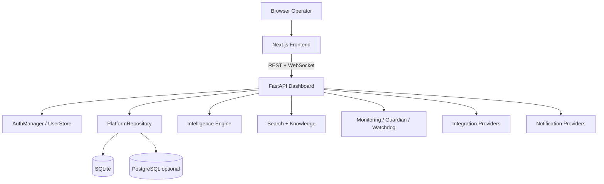
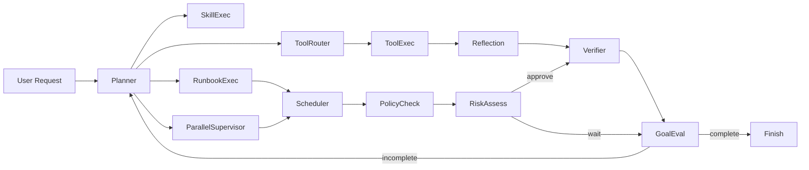
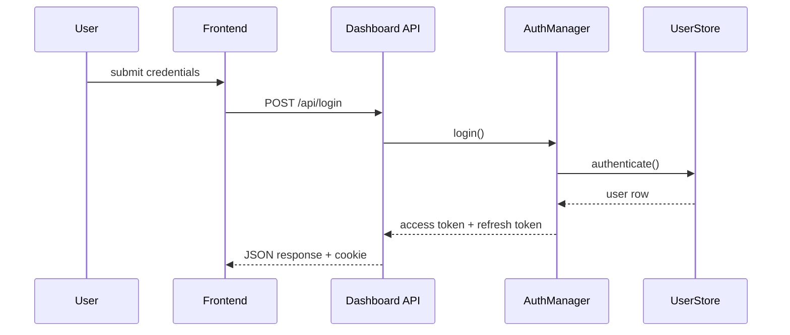
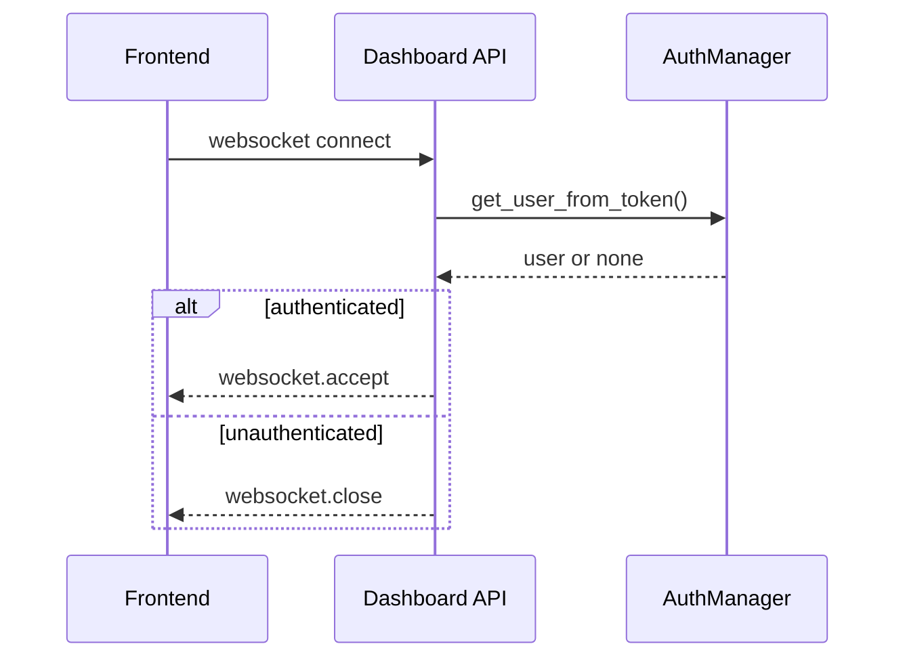
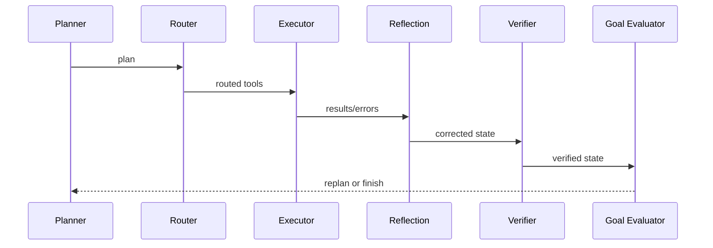

# AegisNex Technical Specification

**Audience:** architects, maintainers, future contributors, and AI assistants  
**Source basis:** current repository code only  
**Status vocabulary:** Implemented, Partially Implemented, Planned  

This document describes the implementation that exists in the codebase today. It does not rely on README text or marketing material. Where behavior is uncertain, that uncertainty is stated explicitly.

---

## 1. Product Vision

### Problem Statement

AegisNex is a security operations and infrastructure operations platform that combines monitoring, incident handling, reporting, audit logging, compliance evidence, and AI-assisted workflows. The codebase is structured so operators can inspect operational state, take actions, and preserve a detailed trail of what happened.

### Business Value

Implemented business value:

- centralized visibility into system health, containers, incidents, targets, and reports
- persistent auditability for administrative and operational actions
- role-based access control for browser and API access
- guided remediation and reporting workflows
- AI-assisted planning, retrieval, tool execution, and reflection
- local SQLite operation with optional PostgreSQL-aware repository logic

### Current Capabilities

Implemented:

- dashboard UI
- REST API for operational, enterprise, AI, search, and telemetry functions
- websocket live updates
- JWT/session auth
- RBAC
- audit logging
- monitoring and notification pipelines
- report generation
- knowledge loading/indexing/retrieval
- agentic AI workflow graph
- runbooks, skills, plugins, workflow designer, multitenancy, backup, compliance

Partially implemented:

- integration providers vary in completeness
- RAG exists but is not backed by a production vector stack
- coworker/agent collaboration exists but is still code-centric rather than productized

### Future Vision

The repository points toward a broader security and operations platform with:

- deeper AI-assisted operations
- more autonomous workflows
- a richer plugin and integration ecosystem
- stronger retrieval and search
- more mature multi-tenant enterprise controls

This is inferred from code structure and module naming, not from a separate roadmap source.

### Security Concerns

The current codebase shows concrete security considerations that should be treated as engineering concerns:

- `src/dashboard.py` is a large high-privilege surface that combines auth helpers, RBAC, REST handlers, websocket handlers, and business logic.
- Session transport is split across cookie and bearer-token fallback paths. These paths must remain consistent.
- Legacy `viewer` roles are normalized to `read_only` in `src/auth.py`; removing that normalization would break backward compatibility and could lock out existing users.
- Several routes degrade to empty responses when optional services are unavailable. This protects availability but can hide configuration issues.
- Websocket auth is manual and handshake-sensitive; small parsing changes can reject all clients.
- `PlatformRepository` contains many hand-authored SQL statements. The code is parameterized, but the SQL surface is broad.
- AI tool execution can reach destructive actions. Safety depends on policy/risk/approval checks staying aligned with tool metadata.
- The platform uses multiple SQLite stores for auth, AI memory, scheduler, and runtime data. Backup and consistency need care.
- Integration providers create credentials and outbound network dependencies that expand the attack surface.

---

## 2. System Architecture

### Overall Architecture

### Frontend

Implemented:

- Next.js App Router pages under `frontend/app`
- dashboard and route-scaffold components
- `frontend/lib/api.ts` REST helpers
- `frontend/lib/auth.tsx` auth context
- `frontend/lib/ws.ts` websocket helper

### Backend

Implemented:

- FastAPI dashboard app in [`src/dashboard.py`](../src/dashboard.py)
- application startup and middleware
- auth and RBAC helpers
- REST endpoints
- websocket endpoints
- service composition

### Database

Implemented:

- SQLite by default
- PostgreSQL-aware SQL generation in repository logic
- schema creation and migrations embedded in repository code

### AI Engine

Implemented:

- LangGraph workflow
- planning, routing, execution, reflection, verification, risk, policy, scheduler, learning

### Integrations

Implemented:

- Slack
- Discord
- Teams
- Jira
- Grafana
- GitHub
- GitLab
- Prometheus
- PagerDuty
- ServiceNow
- Kubernetes
- MCP server

### Monitoring

Implemented:

- host monitor
- Docker monitor
- HTTP/SSL/TCP monitors
- Guardian
- watchdog
- Prometheus exporter
- telemetry

### Notification System

Implemented:

- provider factory
- email, Slack, Discord, webhook-backed notification support

### Security

Implemented:

- JWT auth
- cookie transport
- API key support on selected routes
- RBAC
- token blacklisting
- TLS redirect middleware

### Enterprise Modules

Implemented:

- organizations, teams, projects
- audit
- policies
- secrets
- API keys
- invites and password resets
- approvals
- backup
- compliance
- workflow designer
- plugins

---

## 3. Backend Architecture

### `src/dashboard.py`

Primary FastAPI application. It owns startup, dependency wiring, page rendering, REST endpoints, websocket endpoints, and many helper functions. This is the central backend module.

Dependencies:

- `src.auth`
- `src.platform_db`
- `src.monitoring_engine`
- `src.guardian`
- `src.reporting`
- `src.compliance.*`
- `src.intelligence.*`
- `src.integrations.*`
- `src.search.*`
- `src.multitenant.*`
- `src.telemetry.*`

Implemented responsibilities:

- application factory
- middleware registration
- auth helpers
- dashboard context builders
- API endpoints
- websocket endpoints
- broadcast task wiring

Partially implemented:

- some route bodies depend on optional services and return fallback values if unavailable
- websocket auth is manual rather than framework-declarative

### `src/auth.py`

Auth and user persistence.

Implemented:

- `UserStore`
- `TokenBlacklist`
- `AuthManager`
- JWT creation/validation
- role normalization
- legacy `viewer` compatibility

### `src/platform_db.py`

Primary repository abstraction.

Implemented:

- schema bootstrapping
- migrations
- CRUD for operational and enterprise tables
- audit logging
- generic fetch methods

### `src/storage.py`

Legacy repository retained for older paths/tests.

Status:

- Partially Implemented / Deprecated

### `src/monitor.py`

Host resource monitoring.

Status:

- Implemented

### `src/docker_scanner.py`

Docker/container inspection and operations.

Status:

- Implemented

### `src/guardian.py`

Operational supervision and remediation coordinator.

Status:

- Implemented

### `src/watchdog.py`

Process wrapper for repeated Guardian execution.

Status:

- Implemented

### `src/monitoring_engine.py`

Monitoring orchestration layer.

Status:

- Implemented

### `src/notifier.py`

Notification orchestration.

Status:

- Implemented

### `src/reporting.py`

Report generation and export.

Status:

- Implemented

### `src/compliance/*`

Frameworks, evidence, and compliance checks.

Status:

- Implemented

### `src/search/*`

Search index and search engine.

Status:

- Implemented

### `src/knowledge/*`

Document loading, indexing, retrieval.

Status:

- Implemented

### `src/intelligence/*`

AI graph, nodes, tools, memory, policy, risk, scheduler, runbooks, execution logging, providers.

Status:

- Implemented with some subsystems still heuristic-driven

### `src/integrations/*`

Provider and marketplace modules.

Status:

- Partially Implemented

### `src/multitenant/*`

Tenant models, manager, isolation helpers.

Status:

- Implemented

### `src/plugins/*`

Plugin registry and base classes.

Status:

- Implemented as scaffolding

### `src/telemetry/*`

Telemetry collection and middleware.

Status:

- Implemented

### `src/opentelemetry.py`

Application instrumentation.

Status:

- Implemented

### `src/workflow_designer/*`

Workflow definition, engine, storage, examples.

Status:

- Implemented

---

## 4. Frontend Architecture

### Pages

Implemented pages:

- dashboard
- infrastructure
- incidents
- containers
- targets
- reports
- notifications
- audit
- integrations
- settings
- search
- login
- AI
- MCP
- root landing page

### Layouts

Implemented:

- root layout in [`frontend/app/layout.tsx`](../frontend/app/layout.tsx)
- app shell, sidebar, header, route scaffolds

### Components

Implemented:

- dashboard cards/charts
- loading/error/empty states
- UI primitives
- action drawer
- dialogs, sheets, tables

### State Management

Implemented:

- React state/hooks
- fetch + websocket hydration

No centralized global state library is present.

### Authentication

Implemented:

- `frontend/lib/auth.tsx`
- `/api/auth/verify`
- `/api/login`
- `/logout`
- in-memory token fallback for websocket URLs

### API Communication

Implemented:

- `frontend/lib/api.ts`
- `credentials: "include"` for fetches
- websocket URL construction

### Routing

Implemented:

- Next.js App Router
- route-based page composition

---

## 5. Agentic AI Architecture

### Workflow

### Supervisor

Implemented:

- `src/agents/domain_agents.py`
- `src/agents/supervisors.py`
- `src/agents/orchestrator.py`

Responsibilities:

- coordinate collaborative agents
- dispatch tasks
- aggregate results

### Planner

Implemented in `src/intelligence/nodes.py` (`plan_node`).

Responsibilities:

- infer objective
- select steps
- create parallel batches
- retrieve context via RAG

### Tool Router

Implemented in `src/intelligence/tool_router.py` and `tool_router_node`.

Responsibilities:

- map abstract steps to tools
- collect routing metadata
- avoid execution

### Execution

Implemented in `tool_executor_node`, `execute_tool`, runbook execution, and skill execution.

### Reflection

Implemented in `self_corrector_node` and verifier logic.

### Goal Verification

Implemented in `goal_evaluator_node`.

### Self Correction

Implemented in `self_corrector_node`.

### Execution Logging

Implemented in `src/intelligence/execution_logger.py` and node integration.

### Memory

Implemented in `src/intelligence/memory/sqlite_memory.py`.

### State

Implemented in `src/intelligence/state.py`.

### Scheduler

Implemented in `src/intelligence/scheduler.py` and `scheduler_node`.

### Risk Engine

Implemented in `src/intelligence/risk.py`.

### Policy Engine

Implemented in `src/intelligence/policy.py`.

### Tool Registry

Implemented in `src/intelligence/tools.py`.

### Agent Registry

Implemented in `src/agents/registry.py`.

### Coworkers

Implemented as domain agents and supervisor roles.

Status:

- implemented at the code level
- partially productized as a coworker experience

---

## 6. AI Coworkers

Implemented coworkers:

- InfrastructureAgent
- DockerAgent
- MonitoringAgent
- IncidentAgent
- ReportingAgent
- KnowledgeAgent
- ComplianceAgent
- OperationsSupervisor
- SecuritySupervisor
- ComplianceSupervisor
- InfrastructureSupervisor

Responsibilities:

- infrastructure analysis
- Docker/container analysis
- monitoring interpretation
- incident response support
- report generation
- knowledge retrieval
- compliance analysis

Status:

- implemented, but collaboration UX is still code-driven

---

## 7. Knowledge System

### Loader

Implemented in `src/knowledge/loader.py`.

Supports:

- markdown
- text
- PDF
- SOP documents
- retrospective documents

### Indexer

Implemented in `src/knowledge/indexer.py`.

### Retriever

Implemented in `src/knowledge/retriever.py`.

### Search

Implemented in `src/search/engine.py` and `src/search/indexer.py`.

### Knowledge Store

Current implementation:

- file-based ingestion
- search-index-backed retrieval
- no vector database

Missing capabilities:

- embeddings pipeline
- vector store
- citation enforcement

---

## 8. RAG Audit

RAG exists in a partial form.

Implemented:

- `plan_node` constructs `RAGEngine`
- retrieval result is attached to agent state
- evidence is surfaced in final answers
- search/indexing components collect knowledge and other domain data

Not implemented:

- embeddings
- vector search backend
- formal source citation contract
- reranking pipeline

Prompt assembly is heuristic and node-driven rather than a single canonical RAG assembler.

---

## 9. Infrastructure

Implemented:

- Docker
- Guardian
- monitoring
- incidents
- reports
- notifications
- targets
- runbooks
- healing
- backup
- telemetry
- Prometheus
- OpenTelemetry

---

## 10. Enterprise Platform

Implemented:

- RBAC
- organizations
- audit
- policies
- secrets
- API keys
- compliance
- workflow designer
- plugins
- integrations

---

## 11. Database

Implemented schema areas:

- users
- monitoring targets
- incidents
- notifications
- remediation actions
- audit logs
- metrics snapshots
- reports
- app settings
- notification channels
- API keys
- alert rules
- policies
- execution history
- healing actions
- secrets
- invites
- password resets
- approval queue
- backup records

Repositories:

- `PlatformRepository`
- `UserStore`
- `TokenBlacklist`
- `WorkflowStorage`
- `SQLiteMemoryStore`
- legacy `AegisNexRepository`

Migration system:

- `initialize()`
- `_schema_statements()`
- `_migration_statements()`
- legacy auth/user migration
- legacy incident migration

---

## 12. Integrations

Current implementation status:

- Docker: implemented
- Slack: implemented
- Discord: implemented
- Teams: implemented
- Jira: implemented
- Grafana: implemented
- GitHub: implemented
- GitLab: implemented
- Prometheus: implemented
- PagerDuty: implemented
- ServiceNow: implemented
- Kubernetes: implemented
- MCP: implemented

Provider completeness varies.

---

## 13. API Inventory

This inventory is derived from `src/dashboard.py`.

### Authentication

- `GET /login`
- `POST /api/login`
- `GET /api/auth/verify`
- `GET /logout`
- `POST /register`

### Pages

- `GET /`
- `GET /infrastructure`
- `GET /containers`
- `GET /incidents`
- `GET /actions`
- `GET /reports`
- `GET /reports/{report_type}/{report_format}`
- `GET /notifications`
- `GET /mcp`
- `GET /integrations`
- `GET /settings`
- `GET /audit`

### WebSockets

- `WS /ws/dashboard`
- `WS /ws/incidents`
- `WS /ws/containers`
- `WS /ws/targets`
- `WS /ws/containers/{name}/logs`

### REST

The backend exposes many REST routes for system health, containers, incidents, metrics, notifications, remediations, monitoring targets, integrations, settings, users, API keys, alert rules, invites, password resets, secrets, audit, approvals, policies, backup, compliance, AI, skills, runbooks, workflows, knowledge, search, agents, telemetry, autonomous operations, organizations, and more.

Every endpoint is declared in `src/dashboard.py`. The file is the authoritative route inventory.

---

## 14. Current Feature Matrix

| Feature | Status |
|---|---|
| JWT/session auth | Implemented |
| RBAC | Implemented |
| Audit logging | Implemented |
| Dashboard UI | Implemented |
| Live websocket updates | Implemented |
| Monitoring engine | Implemented |
| Guardian | Implemented |
| Notifications | Implemented |
| Reports | Implemented |
| Compliance | Implemented |
| Search | Implemented |
| Knowledge ingestion | Implemented |
| RAG | Partially Implemented |
| Agent orchestration | Implemented |
| Autonomous AI workflow | Implemented |
| Skills | Implemented |
| Plugins | Implemented |
| Workflow designer | Implemented |
| Multitenancy | Implemented |
| Backup | Implemented |
| Prometheus/OpenTelemetry | Implemented |
| Vector retrieval | Planned |
| Mature coworker product UX | Partially Implemented |
| Full marketplace parity | Partially Implemented |

---

## 15. Technical Debt

Architectural weaknesses:

- `src/dashboard.py` is very large and centralizes too much logic.
- many optional service fallbacks can hide misconfiguration
- RAG lacks vector infrastructure
- integration provider depth is uneven
- websocket auth is manual and brittle
- multiple SQLite stores require careful backup/consistency handling
- AI workflow uses many heuristic/rule-based branches

Missing tests:

- broad end-to-end provider coverage
- robust websocket handshake coverage across all clients/environments
- complete integration lifecycle tests

Performance bottlenecks:

- dashboard context assembly can be expensive
- search/index scans can be broad
- AI execution may block on multiple sequential steps

---

## 16. Production Readiness

Production-ready today:

- auth and RBAC
- audit trails
- dashboard and REST surfaces
- monitoring and incident persistence
- reports
- backup
- telemetry hooks

Still requires implementation/hardening:

- vector RAG
- broader websocket resilience tests
- more provider hardening
- reduced backend monolith size
- stronger operational test coverage

---

## 17. Roadmap

### Version 1.0

- stabilize current backend and frontend surfaces
- reduce monolithic backend complexity
- harden websocket/client auth behavior

### Version 1.1

- stronger integration lifecycle support
- better knowledge retrieval quality
- broader test coverage

### Version 2.0

- vector-backed RAG
- richer agent coworker UX
- more mature multi-tenant controls
- broader plugin marketplace

---

## 18. Code Ownership Map

Core platform:

- Auth: `src/auth.py`
- Dashboard/API: `src/dashboard.py`
- Persistence: `src/platform_db.py`
- Legacy storage: `src/storage.py`

Operations:

- Monitoring: `src/monitor.py`, `src/monitoring_engine.py`
- Guardian: `src/guardian.py`
- Watchdog: `src/watchdog.py`
- Notification: `src/notifier.py`, `src/notifications/*`
- Reporting: `src/reporting.py`

AI/Automation:

- Graph: `src/intelligence/graph.py`
- Nodes: `src/intelligence/nodes.py`
- Tools: `src/intelligence/tools.py`
- Risk/policy: `src/intelligence/risk.py`, `src/intelligence/policy.py`
- Memory: `src/intelligence/memory/sqlite_memory.py`
- Execution logging: `src/intelligence/execution_logger.py`
- Runbooks: `src/intelligence/runbooks/*`
- Skills: `src/skills/*`

Knowledge/Search:

- Knowledge: `src/knowledge/*`
- Search: `src/search/*`

Enterprise:

- Multitenant: `src/multitenant/*`
- Compliance: `src/compliance/*`
- Plugins: `src/plugins/*`
- Workflow designer: `src/workflow_designer/*`
- Integrations: `src/integrations/*`
- Backup: `src/backup.py`
- Secrets: `src/secrets.py`

Frontend:

- App routes: `frontend/app/*`
- Components: `frontend/components/*`
- API helpers: `frontend/lib/api.ts`
- Auth helpers: `frontend/lib/auth.tsx`
- Websocket helpers: `frontend/lib/ws.ts`

---

## Appendix: Diagrams

### Login Flow

### WebSocket Auth Flow

### AI Workflow

