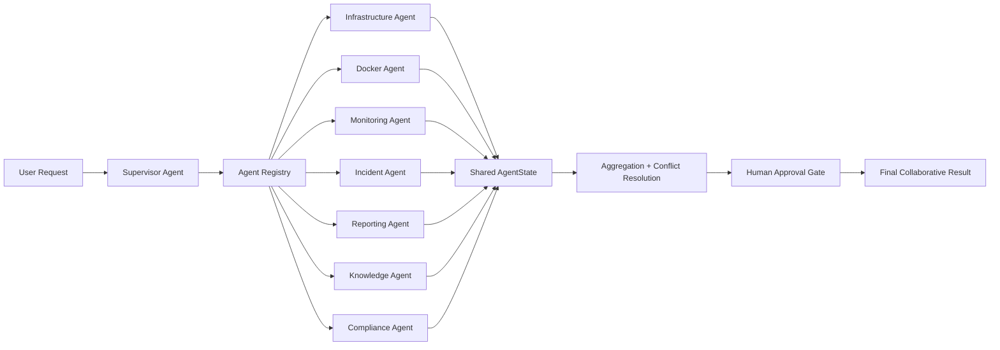

# Sprint D: AI Coworkers

## Status

Implemented as a collaborative layer on top of the existing Sprint C LangGraph workflow.

## Architecture



## Agent Interaction Flow

1. The Supervisor Agent decomposes the request into specialist subtasks.
2. The Agent Registry selects the relevant domain agents.
3. Relevant agents execute in parallel when their subtasks are independent.
4. Each agent reads and writes only through shared AgentState.
5. The registry aggregates outputs, resolves conflicts, and scores confidence.
6. Destructive actions or approvals are surfaced through a human approval gate.
7. The final collaborative result is written back to shared state for downstream consumers.

## Registry Implementation

The registry lives in [src/agents/registry.py](../src/agents/registry.py) and provides:

- Agent registration and discovery
- Task dispatch to a target agent
- Supervisor-led task decomposition
- Parallel fan-out for independent subtasks
- Conflict resolution based on signal confidence
- Aggregation of tool results and execution metrics
- Shared-state writeback for traceability

The default collaborative roster is:

- SupervisorAgent
- InfrastructureAgent
- DockerAgent
- MonitoringAgent
- IncidentAgent
- ReportingAgent
- KnowledgeAgent
- ComplianceAgent

## Sample Execution Trace

Request: `check system health and recent incidents`

1. SupervisorAgent plans a collaboration with MonitoringAgent, IncidentAgent, and KnowledgeAgent.
2. MonitoringAgent collects metrics and target data.
3. IncidentAgent reviews incident history and notifications.
4. KnowledgeAgent searches prior learnings for similar issues.
5. The registry merges the results into shared AgentState.
6. If MonitoringAgent reports `system_health=healthy` and InfrastructureAgent later reports `system_health=degraded`, the registry resolves the conflict by confidence.
7. The shared state is updated with confidence, conflicts, execution metrics, and a combined summary.

Example outcome fields:

```json
{
  "confidence": 0.88,
  "goal_completed": true,
  "conflicts": [
    {
      "signal": "system_health",
      "values": ["healthy", "degraded"],
      "resolved_by": "monitoring-agent"
    }
  ],
  "execution_metrics": {
    "agent_count": 3,
    "success_count": 3,
    "conflict_count": 1
  }
}
```

## Integration Tests

Coverage is provided by [tests/test_multi_agent_collaboration.py](../tests/test_multi_agent_collaboration.py):

- Registry conflict resolution
- Supervisor delegation
- Approval gating
- Default agent registration
- Orchestrator compatibility

## Constraints Preserved

- Sprint C LangGraph nodes remain unchanged
- No frontend changes
- No backend API changes
- No duplicate business logic
- No duplicate API calls across agents for the same task path
- Existing authentication remains untouched
